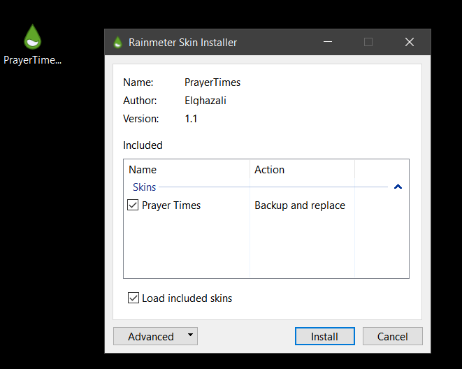
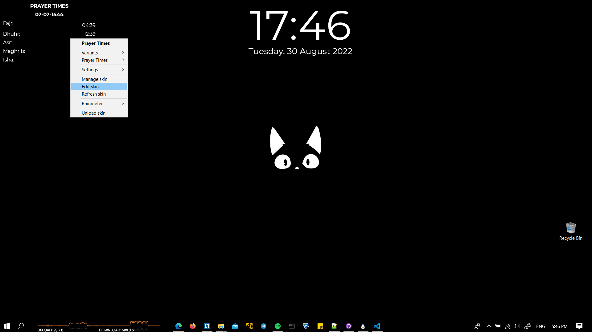
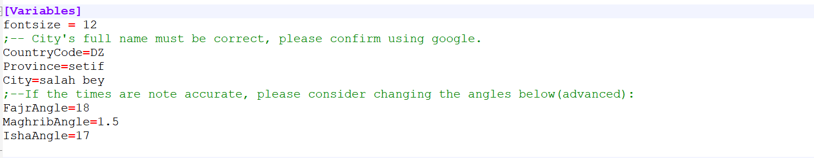

# Prayer Times Windows widget
Prayer Times RAINMETER widget for windows.
## Instructions:
### 1. Installation:
- Download and install ``Rainmeter``, Link: https://www.rainmeter.net/  .

- Download [Prayer Times](./Download/PrayerTimes_1.1.rmskin) skin.

- Double click to install the ``rmskin``:  

### 2. Configurations:
- After the skin is loaded, please change your location: ``right click`` -> ``Edit skin``

- you can change:
  - font size, 
  - Country code (DZ, USA, EGY...)
  - Province (must be correct)
  - City (must be correct)
  

- Optional: If the times are note accurate, please consider changing the Fajr, Maghrib and Isha angles.  
these angle changes depends on the country calculation method.

## LICENCE:
The source code for this project is licensed under the MIT license, which you can find in the [LICENSE](./LICENSE) file.